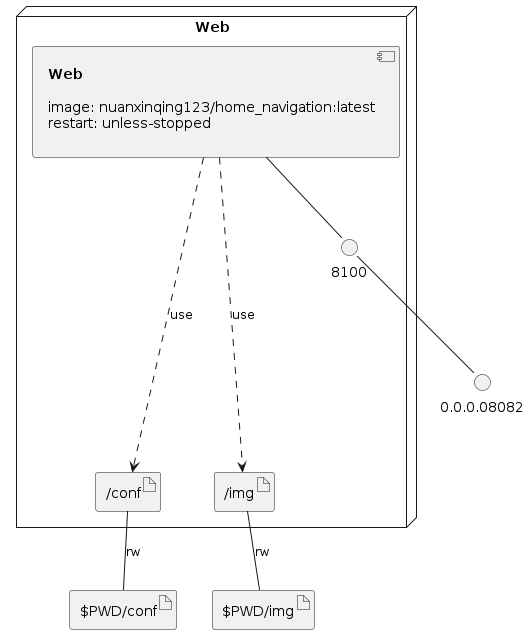

## 个人导航页

程序的起因是因为家里申请了公网IP，因此购置了一套服务器在家里放着。但是方便操作和记忆，因为写了此导航来可以快速的从内网或者外网访问家里的某些服务

演示地址：https://navigation.6b7.org/

### docker-compose安装

```shell
# 下载二进制文件
sudo curl -L "https://github.com/docker/compose/releases/download/v2.2.2/docker-compose-$(uname -s)-$(uname -m)" -o /usr/local/bin/docker-compose

# 可执行权限应用于二进制文件
sudo chmod +x /usr/local/bin/docker-compose

# 创建软链
sudo ln -s /usr/local/bin/docker-compose /usr/bin/docker-compose

# 测试是否安装成功
docker-compose --version
```

### docker-compose部署

```text
// 第一步：克隆仓库并进入
git clone https://github.com/nuanxinqing123/HomeNavigation && cd HomeNavigation

// 第二步：运行Docker
# 启动
docker-compose up -d
# 停止
docker-compose down
```

好了，部署完成。如果需要修改前端的显示内容，直接修改 conf/config.json里面的内容就好了。还有就是启动命令默认是8082端口，大家自行修改一下

**Tips：因为版本更新可能会变动json文件。所以推荐更新之前先把原来的json文件修改名字，下载新的json文件之后把原来的内容再拷贝过去**

### config.json 文件

```json
{
  "Index": {
    // 网站LOGO（支持相对&绝对路径、支持图床外链）
    "Logo": "img/logo.png",
    // 网站ico（支持相对&绝对路径、支持图床外链）
    "Favicon": "img/favicon.ico",
    // 网站标题
    "Title": "Cloud Services"
  },
  "SoftWare": {
    // 程序运行端口（修改后重启生效）      
    "port": "8100",
    // 访问密码（“”留空代表关闭密码访问，实时生效）
    "password": "",
    // 内外网模式【N为内网，W为外网（大写 & 必填）】
    "Mode": "",
    // 是否开启Debug
    "Debug": "",
    // 日志等级
    "LogLevel": "info"
  },
  "Data": [
    {
      // 显示顺序（不可以重复）   
      "id": 1,
      // 图标标题
      "title": "我的博客",
      // 图标图片（支持相对&绝对路径、支持图床外链）
      "ico": "img/xxx.png",
      // 外网访问地址（可空）
      "w_link": "https://6b7.org/",
      // 内网访问地址（可空）  
      "n_link": "https://6b7.org/"
    }
  ],
    "Footer":[
      // 页脚网站信息，同上：可以使用 {} 增加显示项目，但是推荐不要超过3个
      {
        "Text": "",
        // TextLink如果不需要可以空着，这样前端就不会渲染 a 标签
        "TextLink": ""
      }
    ],
    "FooterStyle":{
      // Web背景图片（推荐图床外链）
      "Background": "",
      // 渐变色背景(支持颜色的英文单词和十六进制颜色值)
      // 当Background值为空时, 启用渐变值
      "BackgroundColorA": "#acb6e5",
      "BackgroundColorB": "#86fde8",
      // LOGO下方文字颜色(支持颜色的英文单词和十六进制颜色值)
      "LColor": "#E1DFCD",
      // 图标下方文字颜色(支持颜色的英文单词和十六进制颜色值)
      "SColor": "#E1DFCD",
      // 页脚文字颜色(支持颜色的英文单词和十六进制颜色值)
      "FColor": "#E1DFCD"
    }
}
```

### 添加新的项目

新站点

```json
    {
  "id":,
  "title": "",
  "ico": "",
  "w_link": "",
  "n_link": ""
}
```

新页脚

```json
    {
  "Text": "",
  "TextLink": ""
}
```

如果需要添加新的站点到页面，请在Data的 `[ ]` 里面按照如上格式添加。

**Tips：所有的 `{ }` 后面都需要添加一个英文逗号，除了最后一个 `{ }`**

### 配置文件说明

以上配置文件是整个程序的所有配置项，由于程序采用JSON文件实时读取的方式，所以修改配置过后均可实时生效（除了端口需要重启生效）。

### 前端模板说明

模板经过修改，原版模板来自于：http://www.wdmomo.fun:81/home/

### 版本通知

```text
2022.03.17：V1.8
1、前端由原生H5转换为Vue开发
2、保留本地图片接口（引用路径：img/xxx.png）
3、新增渐变色背景，当Background选项为空时。启用渐变色背景

2022.02.24：V1.7
1、新增内外网首显控制开关
2、新增LOGO文字、图标文字颜色控制
3、更换docker-compose.yml部署方式

2022.01.26：V1.6
1、修复CSS错误部分
2、大幅度缩减Docker镜像体积（15M+）

2021.12.06：V1.5
1、修复显示图片的一个错误

2021.11.30：V1.4
1、修复背景图CSS兼容性问题
2、增加访问密码选项（Cookie有效期30天, 留空代表关闭密码访问）

2021.11.25：V1.3
1、修复CSS多项目加载错误（1.1遗留BUG）
2、更改新的页脚显示方式（可自定义页脚信息Link）

2021.11.21：V1.2
1、增加空路由提示
2、增加更多可以控制元素（自定义背景图、色）
3、更换新的背景图

2021.11.18：V1.1
1、修复CSS的部分错误
2、目前CSS任然存在问题，推荐添加Web不要超过16个
3、添加所有演示图标

2021.11.17：V1.0
1、支持内网外网添加定义
2、JSON文件动态加载全网页
```

### Q & A
```text
Q:能不能自定义图标下面文字的颜色，浅色背景下字看不清
A:修改配置文件的 LColor、SColor、FColor 内容即可

Q:能不能自定义前端HTML部分
A:暂时不可以

Q:有没有Arm架构的版本
A:暂时没有打包，需要自行Clone源码并编译

Q:如何自己定义上传图片？
A:可以，请将自定义图片上传到img目录里面。但是推荐大家使用图床（推荐我的个人图床：https://img.6b7.xyz）
```

### Infrastructure model

